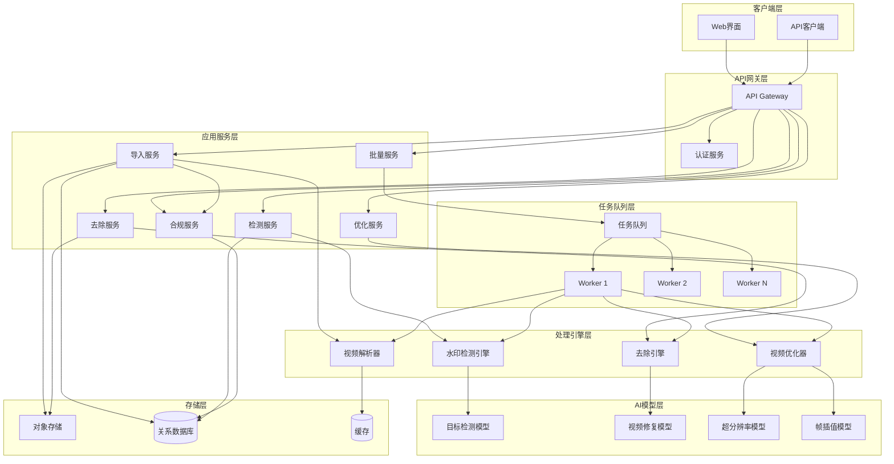

# 设计文档

## 概述

视频再创作智能处理平台是一个基于AI的视频处理系统，提供水印检测、智能去除和视频优化功能。系统采用模块化架构，将视频导入、水印处理、批量操作、视频优化和合规管理分离为独立模块，确保高内聚低耦合。

核心技术栈包括：
- 视频处理：FFmpeg、OpenCV
- AI模型：目标检测（YOLO/Faster R-CNN）、视频修复（Deep Video Inpainting）、超分辨率（ESRGAN）
- 后端：Python/Node.js + 异步任务队列（Celery/Bull）
- 存储：对象存储（S3/MinIO）+ 关系数据库（PostgreSQL）
- 前端：React + WebSocket（实时进度更新）

系统设计重点：
1. 异步处理架构：所有耗时操作（AI推理、视频编码）通过任务队列异步执行
2. 流式处理：大文件采用分块上传和流式处理，避免内存溢出
3. 合规优先：所有操作前置版权验证，记录完整审计日志
4. 可扩展性：AI模型和处理策略可插拔，支持水平扩展

## 架构

### 系统架构图



### 架构说明

1. **客户端层**：提供Web界面和API客户端，支持用户交互和程序化调用

2. **API网关层**：统一入口，处理认证、限流、路由

3. **应用服务层**：业务逻辑层，每个服务负责特定功能域
   - ImportService：处理视频导入（本地上传、平台授权、链接解析）
   - DetectionService：协调水印检测流程
   - RemovalService：协调水印去除流程
   - OptimizationService：协调视频优化流程
   - ComplianceService：版权验证和审计日志
   - BatchService：批量任务编排

4. **处理引擎层**：核心处理逻辑，封装复杂算法
   - VideoParser：视频解析和元数据提取
   - WatermarkDetector：水印检测算法
   - RemovalEngine：多策略水印去除（裁剪、AI修复、模糊替换）
   - VideoOptimizer：视频质量优化

5. **AI模型层**：深度学习模型，提供AI能力
   - ObjectDetection：检测水印位置
   - VideoInpainting：修复水印区域
   - SuperResolution：分辨率提升
   - FrameInterpolation：帧率提升

6. **任务队列层**：异步任务处理，支持并发和重试

7. **存储层**：数据持久化
   - ObjectStorage：存储视频文件
   - Database：存储元数据、任务状态、审计日志
   - Cache：缓存热点数据（视频元数据、检测结果）

## 组件和接口

### 1. Video_Import_Module（视频导入模块）

**职责**：接收视频文件，提取元数据，验证格式和大小

**接口**：

```python
class VideoImportModule:
    def upload_local_video(self, file: UploadFile, user_id: str) -> VideoImportResult:
        """
        上传本地视频文件
        
        参数:
            file: 上传的文件对象
            user_id: 用户ID
            
        返回:
            VideoImportResult: 包含video_id、metadata、storage_path
            
        异常:
            FileSizeExceededError: 文件大小超过5GB
            UnsupportedFormatError: 不支持的视频格式
        """
        pass
    
    def import_from_platform(self, platform: str, video_ids: List[str], 
                            auth_token: str, user_id: str) -> List[VideoImportResult]:
        """
        从授权平台导入视频
        
        参数:
            platform: 平台名称（如"youtube", "tiktok"）
            video_ids: 视频ID列表
            auth_token: OAuth2授权令牌
            user_id: 用户ID
            
        返回:
            List[VideoImportResult]: 导入结果列表
            
        异常:
            InvalidTokenError: 授权令牌无效或过期
            UnauthorizedAccessError: 无权访问指定视频
        """
        pass
    
    def import_from_url(self, url: str, user_id: str) -> VideoImportResult:
        """
        通过URL导入视频
        
        参数:
            url: 视频链接
            user_id: 用户ID
            
        返回:
            VideoImportResult: 导入结果
            
        异常:
            InvalidUrlError: 链接无效
            VideoNotAccessibleError: 视频不可访问
        """
        pass
    
    def extract_metadata(self, video_path: str) -> VideoMetadata:
        """
        提取视频元数据
        
        参数:
            video_path: 视频文件路径
            
        返回:
            VideoMetadata: 包含分辨率、时长、格式、编码、帧率、码率
            
        异常:
            MetadataExtractionError: 元数据提取失败
        """
        pass
    
    def parse_video_metadata(self, video_path: str) -> VideoMetadata:
        """
        解析视频元数据为标准化内部数据结构
        
        参数:
            video_path: 视频文件路径
            
        返回:
            VideoMetadata: 标准化的元数据对象
            
        异常:
            CorruptedVideoError: 视频文件损坏
            UnsupportedFormatError: 格式不支持
        """
        pass
    
    def format_metadata(self, metadata: VideoMetadata) -> str:
        """
        格式化元数据为可读文本
        
        参数:
            metadata: 视频元数据对象
            
        返回:
            str: 格式化的文本表示
        """
        pass
```

### 2. Watermark_Detection_Engine（水印检测引擎）

**职责**：使用AI模型检测水印，支持手动标记

**接口**：

```python
class WatermarkDetectionEngine:
    def auto_detect(self, video_id: str) -> List[WatermarkRegion]:
        """
        自动检测视频中的水印
        
        参数:
            video_id: 视频ID
            
        返回:
            List[WatermarkRegion]: 检测到的水印区域列表
            
        说明:
            - 使用目标检测模型扫描视频帧
            - 识别角标、滚动水印、半透明logo、固定字幕
            - 在视频时长的2倍时间内完成
        """
        pass
    
    def manual_mark(self, video_id: str, regions: List[BoundingBox]) -> List[WatermarkRegion]:
        """
        手动标记水印区域
        
        参数:
            video_id: 视频ID
            regions: 用户框选的区域列表
            
        返回:
            List[WatermarkRegion]: 标记的水印区域列表
        """
        pass
    
    def update_region(self, region_id: str, new_bbox: BoundingBox) -> WatermarkRegion:
        """
        更新已标记的水印区域
        
        参数:
            region_id: 区域ID
            new_bbox: 新的边界框
            
        返回:
            WatermarkRegion: 更新后的水印区域
        """
        pass
    
    def get_detection_result(self, video_id: str) -> DetectionResult:
        """
        获取检测结果
        
        参数:
            video_id: 视频ID
            
        返回:
            DetectionResult: 包含所有水印区域和预览数据
        """
        pass
```

### 3. Removal_Engine（智能去除引擎）

**职责**：提供多种水印去除策略

**接口**：

```python
class RemovalEngine:
    def crop_reconstruct(self, video_id: str, regions: List[WatermarkRegion]) -> RemovalResult:
        """
        裁剪重构模式去除水印
        
        参数:
            video_id: 视频ID
            regions: 水印区域列表
            
        返回:
            RemovalResult: 包含处理后视频路径、裁剪参数、主体完整度
            
        说明:
            - 分析视频主体区域
            - 推荐裁剪比例以排除水印
            - 确保主体内容完整度不低于90%
            - 保持原始帧率和编码格式
        """
        pass
    
    def ai_inpainting(self, video_id: str, regions: List[WatermarkRegion]) -> RemovalResult:
        """
        AI修复填充模式去除水印
        
        参数:
            video_id: 视频ID
            regions: 水印区域列表
            
        返回:
            RemovalResult: 包含处理后视频路径、质量评分
            
        说明:
            - 使用视频修复算法处理水印区域
            - 确保时序一致性，避免闪烁或跳变
            - 在视频时长的5倍时间内完成
            - 质量评分低于70分时返回警告
        """
        pass
    
    def blur_replace(self, video_id: str, regions: List[WatermarkRegion], 
                     mode: str, custom_logo: Optional[str] = None) -> RemovalResult:
        """
        局部模糊替换模式去除水印
        
        参数:
            video_id: 视频ID
            regions: 水印区域列表
            mode: "blur"（模糊）或"logo"（logo替换）
            custom_logo: 自定义logo路径（mode为"logo"时必需）
            
        返回:
            RemovalResult: 包含处理后视频路径
            
        说明:
            - 模糊模式：对水印区域应用高斯模糊
            - logo模式：用自定义logo覆盖水印区域
            - 在视频时长的1倍时间内完成
        """
        pass
```

### 4. Batch_Processor（批量处理器）

**职责**：支持批量上传、检测和导出

**接口**：

```python
class BatchProcessor:
    def batch_upload(self, files: List[UploadFile], user_id: str) -> BatchUploadResult:
        """
        批量上传视频
        
        参数:
            files: 文件列表（最多50个）
            user_id: 用户ID
            
        返回:
            BatchUploadResult: 包含每个文件的上传状态和进度
            
        说明:
            - 并行上传最多5个文件
            - 单个文件失败不影响其他文件
        """
        pass
    
    def batch_detect(self, video_ids: List[str]) -> BatchDetectionResult:
        """
        批量检测水印
        
        参数:
            video_ids: 视频ID列表
            
        返回:
            BatchDetectionResult: 包含所有视频的检测结果汇总
            
        说明:
            - 并行处理最多3个视频
        """
        pass
    
    def batch_process(self, tasks: List[ProcessingTask]) -> BatchProcessingResult:
        """
        批量处理视频
        
        参数:
            tasks: 处理任务列表，每个任务包含video_id、mode、regions
            
        返回:
            BatchProcessingResult: 批量处理结果
        """
        pass
    
    def batch_export(self, video_ids: List[str], format: str) -> ExportResult:
        """
        批量导出视频
        
        参数:
            video_ids: 视频ID列表
            format: "zip"（压缩包）或"separate"（单独文件）
            
        返回:
            ExportResult: 包含下载链接
        """
        pass
```

### 5. Video_Optimizer（视频优化器）

**职责**：提供视频质量优化功能

**接口**：

```python
class VideoOptimizer:
    def dedup_compress(self, video_id: str) -> OptimizationResult:
        """
        去重压缩
        
        参数:
            video_id: 视频ID
            
        返回:
            OptimizationResult: 包含处理后视频路径、压缩率、质量评分
            
        说明:
            - 分析并移除重复帧
            - 使用H.265编码压缩
            - 文件大小减少至少20%
            - 质量评分不低于原视频的85%
        """
        pass
    
    def upscale_resolution(self, video_id: str, target_resolution: str) -> OptimizationResult:
        """
        分辨率提升
        
        参数:
            video_id: 视频ID
            target_resolution: "1080p"或"4K"
            
        返回:
            OptimizationResult: 包含处理后视频路径
            
        说明:
            - 使用超分辨率算法
            - 支持720p→1080p、1080p→4K
            - 在视频时长的8倍时间内完成
        """
        pass
    
    def fix_framerate(self, video_id: str, target_fps: int) -> OptimizationResult:
        """
        帧率修复
        
        参数:
            video_id: 视频ID
            target_fps: 目标帧率（30或60）
            
        返回:
            OptimizationResult: 包含处理后视频路径
            
        说明:
            - 使用帧插值算法
            - 确保时序连贯性
        """
        pass
    
    def optimize_bitrate(self, video_id: str) -> OptimizationResult:
        """
        码率优化
        
        参数:
            video_id: 视频ID
            
        返回:
            OptimizationResult: 包含处理后视频路径、优化后码率、质量评分
            
        说明:
            - 分析内容复杂度
            - 使用动态码率编码
            - 质量评分不低于原视频的90%
            - 文件大小减少至少15%
        """
        pass
```

### 6. Compliance_Module（合规模块）

**职责**：版权验证、授权管理、审计日志

**接口**：

```python
class ComplianceModule:
    def verify_copyright(self, video_id: str, user_id: str) -> CopyrightVerification:
        """
        验证版权声明
        
        参数:
            video_id: 视频ID
            user_id: 用户ID
            
        返回:
            CopyrightVerification: 包含验证状态、声明记录
            
        说明:
            - 首次上传时显示版权声明条款
            - 要求用户确认拥有版权或已获授权
            - 记录确认时间和IP地址
        """
        pass
    
    def validate_auth_token(self, platform: str, token: str) -> TokenValidation:
        """
        验证授权令牌
        
        参数:
            platform: 平台名称
            token: OAuth2授权令牌
            
        返回:
            TokenValidation: 包含有效性、授权范围、过期时间
            
        说明:
            - 验证令牌有效性
            - 每30天重新验证
            - 令牌撤销时删除相关视频访问权限
        """
        pass
    
    def log_operation(self, user_id: str, operation_type: str, 
                     video_id: str, details: dict) -> None:
        """
        记录操作日志
        
        参数:
            user_id: 用户ID
            operation_type: 操作类型（upload/process/export）
            video_id: 视频ID
            details: 操作详情
            
        说明:
            - 记录所有上传、处理、导出操作
            - 保存日志至少180天
            - 异常操作标记为高风险并发送告警
        """
        pass
    
    def check_risk(self, video_id: str, watermarks: List[WatermarkRegion]) -> RiskAssessment:
        """
        风险识别
        
        参数:
            video_id: 视频ID
            watermarks: 检测到的水印列表
            
        返回:
            RiskAssessment: 包含风险等级、提醒信息
            
        说明:
            - 检测第三方平台水印
            - 显示风险提醒和法律后果说明
            - 要求用户确认版权
        """
        pass
```

## 数据模型

### 核心实体

```python
from dataclasses import dataclass
from typing import List, Optional
from datetime import datetime
from enum import Enum

class VideoFormat(Enum):
    MP4 = "mp4"
    AVI = "avi"
    MOV = "mov"
    MKV = "mkv"

class ProcessingMode(Enum):
    CROP_RECONSTRUCT = "crop_reconstruct"
    AI_INPAINTING = "ai_inpainting"
    BLUR_REPLACE = "blur_replace"

class TaskStatus(Enum):
    PENDING = "pending"
    PROCESSING = "processing"
    COMPLETED = "completed"
    FAILED = "failed"

@dataclass
class VideoMetadata:
    """视频元数据"""
    video_id: str
    format: VideoFormat
    resolution: tuple[int, int]  # (width, height)
    duration: float  # 秒
    codec: str  # 编码格式，如"h264", "h265"
    framerate: float  # 帧率
    bitrate: int  # 码率，单位bps
    file_size: int  # 文件大小，单位字节
    created_at: datetime

@dataclass
class BoundingBox:
    """边界框"""
    x: int  # 左上角x坐标
    y: int  # 左上角y坐标
    width: int  # 宽度
    height: int  # 高度

@dataclass
class WatermarkRegion:
    """水印区域"""
    region_id: str
    video_id: str
    bbox: BoundingBox
    start_time: float  # 开始时间，单位秒
    end_time: float  # 结束时间，单位秒
    confidence: float  # 置信度，0-1
    watermark_type: str  # "corner", "rolling", "logo", "subtitle"
    detection_method: str  # "auto"或"manual"

@dataclass
class VideoImportResult:
    """视频导入结果"""
    video_id: str
    metadata: VideoMetadata
    storage_path: str
    import_source: str  # "local", "platform", "url"
    import_time: datetime

@dataclass
class DetectionResult:
    """水印检测结果"""
    video_id: str
    watermarks: List[WatermarkRegion]
    detection_time: datetime
    processing_duration: float  # 处理耗时，单位秒

@dataclass
class RemovalResult:
    """水印去除结果"""
    video_id: str
    output_video_id: str
    output_path: str
    processing_mode: ProcessingMode
    quality_score: Optional[float]  # 质量评分，0-100
    processing_duration: float
    parameters: dict  # 处理参数，如裁剪比例、模糊半径等

@dataclass
class OptimizationResult:
    """视频优化结果"""
    video_id: str
    output_video_id: str
    output_path: str
    optimization_type: str  # "dedup_compress", "upscale", "fix_framerate", "optimize_bitrate"
    original_size: int
    optimized_size: int
    quality_score: float
    processing_duration: float

@dataclass
class CopyrightDeclaration:
    """版权声明"""
    declaration_id: str
    user_id: str
    video_id: str
    confirmed: bool
    confirmation_time: datetime
    ip_address: str
    declaration_text: str

@dataclass
class AuthorizationToken:
    """授权令牌"""
    token_id: str
    user_id: str
    platform: str  # "youtube", "tiktok"等
    access_token: str
    refresh_token: Optional[str]
    expires_at: datetime
    scope: List[str]  # 授权范围
    created_at: datetime
    last_validated: datetime

@dataclass
class OperationLog:
    """操作日志"""
    log_id: str
    user_id: str
    operation_type: str  # "upload", "detect", "remove", "optimize", "export"
    video_id: str
    timestamp: datetime
    ip_address: str
    details: dict
    risk_level: str  # "low", "medium", "high"

@dataclass
class ProcessingTask:
    """处理任务"""
    task_id: str
    user_id: str
    video_id: str
    task_type: str  # "detection", "removal", "optimization"
    status: TaskStatus
    parameters: dict
    created_at: datetime
    started_at: Optional[datetime]
    completed_at: Optional[datetime]
    error_message: Optional[str]
    result: Optional[dict]

@dataclass
class BatchJob:
    """批量任务"""
    job_id: str
    user_id: str
    job_type: str  # "upload", "detect", "process", "export"
    total_count: int
    completed_count: int
    failed_count: int
    status: TaskStatus
    tasks: List[ProcessingTask]
    created_at: datetime
    completed_at: Optional[datetime]
```

### 数据库表结构

```sql
-- 视频表
CREATE TABLE videos (
    video_id VARCHAR(36) PRIMARY KEY,
    user_id VARCHAR(36) NOT NULL,
    format VARCHAR(10) NOT NULL,
    resolution_width INT NOT NULL,
    resolution_height INT NOT NULL,
    duration FLOAT NOT NULL,
    codec VARCHAR(20) NOT NULL,
    framerate FLOAT NOT NULL,
    bitrate BIGINT NOT NULL,
    file_size BIGINT NOT NULL,
    storage_path VARCHAR(500) NOT NULL,
    import_source VARCHAR(20) NOT NULL,
    created_at TIMESTAMP DEFAULT CURRENT_TIMESTAMP,
    INDEX idx_user_id (user_id),
    INDEX idx_created_at (created_at)
);

-- 水印区域表
CREATE TABLE watermark_regions (
    region_id VARCHAR(36) PRIMARY KEY,
    video_id VARCHAR(36) NOT NULL,
    bbox_x INT NOT NULL,
    bbox_y INT NOT NULL,
    bbox_width INT NOT NULL,
    bbox_height INT NOT NULL,
    start_time FLOAT NOT NULL,
    end_time FLOAT NOT NULL,
    confidence FLOAT NOT NULL,
    watermark_type VARCHAR(20) NOT NULL,
    detection_method VARCHAR(10) NOT NULL,
    created_at TIMESTAMP DEFAULT CURRENT_TIMESTAMP,
    FOREIGN KEY (video_id) REFERENCES videos(video_id) ON DELETE CASCADE,
    INDEX idx_video_id (video_id)
);

-- 版权声明表
CREATE TABLE copyright_declarations (
    declaration_id VARCHAR(36) PRIMARY KEY,
    user_id VARCHAR(36) NOT NULL,
    video_id VARCHAR(36) NOT NULL,
    confirmed BOOLEAN NOT NULL,
    confirmation_time TIMESTAMP NOT NULL,
    ip_address VARCHAR(45) NOT NULL,
    declaration_text TEXT NOT NULL,
    FOREIGN KEY (video_id) REFERENCES videos(video_id) ON DELETE CASCADE,
    INDEX idx_user_id (user_id),
    INDEX idx_video_id (video_id)
);

-- 授权令牌表
CREATE TABLE authorization_tokens (
    token_id VARCHAR(36) PRIMARY KEY,
    user_id VARCHAR(36) NOT NULL,
    platform VARCHAR(50) NOT NULL,
    access_token TEXT NOT NULL,
    refresh_token TEXT,
    expires_at TIMESTAMP NOT NULL,
    scope JSON NOT NULL,
    created_at TIMESTAMP DEFAULT CURRENT_TIMESTAMP,
    last_validated TIMESTAMP NOT NULL,
    INDEX idx_user_id (user_id),
    INDEX idx_platform (platform)
);

-- 操作日志表
CREATE TABLE operation_logs (
    log_id VARCHAR(36) PRIMARY KEY,
    user_id VARCHAR(36) NOT NULL,
    operation_type VARCHAR(20) NOT NULL,
    video_id VARCHAR(36),
    timestamp TIMESTAMP DEFAULT CURRENT_TIMESTAMP,
    ip_address VARCHAR(45) NOT NULL,
    details JSON NOT NULL,
    risk_level VARCHAR(10) NOT NULL,
    INDEX idx_user_id (user_id),
    INDEX idx_timestamp (timestamp),
    INDEX idx_risk_level (risk_level)
);

-- 处理任务表
CREATE TABLE processing_tasks (
    task_id VARCHAR(36) PRIMARY KEY,
    user_id VARCHAR(36) NOT NULL,
    video_id VARCHAR(36) NOT NULL,
    task_type VARCHAR(20) NOT NULL,
    status VARCHAR(20) NOT NULL,
    parameters JSON NOT NULL,
    created_at TIMESTAMP DEFAULT CURRENT_TIMESTAMP,
    started_at TIMESTAMP,
    completed_at TIMESTAMP,
    error_message TEXT,
    result JSON,
    FOREIGN KEY (video_id) REFERENCES videos(video_id) ON DELETE CASCADE,
    INDEX idx_user_id (user_id),
    INDEX idx_status (status),
    INDEX idx_created_at (created_at)
);

-- 批量任务表
CREATE TABLE batch_jobs (
    job_id VARCHAR(36) PRIMARY KEY,
    user_id VARCHAR(36) NOT NULL,
    job_type VARCHAR(20) NOT NULL,
    total_count INT NOT NULL,
    completed_count INT NOT NULL DEFAULT 0,
    failed_count INT NOT NULL DEFAULT 0,
    status VARCHAR(20) NOT NULL,
    created_at TIMESTAMP DEFAULT CURRENT_TIMESTAMP,
    completed_at TIMESTAMP,
    INDEX idx_user_id (user_id),
    INDEX idx_status (status)
);
```


## 正确性属性

*属性是系统在所有有效执行中应该保持为真的特征或行为——本质上是关于系统应该做什么的形式化陈述。属性作为人类可读规范和机器可验证正确性保证之间的桥梁。*

### 属性反思

在分析所有验收标准后，我识别出以下可测试属性。经过冗余分析：

- 属性1.1（接受支持格式）和属性3.1（解析有效链接）都涉及格式验证，但作用于不同的输入源，保留两者
- 属性1.3（提取元数据）和属性4.1（提取所有元数据字段）是重复的，合并为一个属性
- 属性2.4（下载视频）和属性3.2（解析后下载）都是下载操作，但触发条件不同，保留两者
- 属性7.4（生成裁剪视频）、属性8.3（生成AI修复视频）、属性9.2/9.4（生成模糊/logo替换视频）都是生成输出文件，但处理模式不同，合并为一个通用属性
- 属性13.2（去重保持时长）是去重操作的特定不变量，保留
- 属性13.4（压缩率）和属性16.5（优化压缩率）都是文件大小减少，但阈值不同，保留两者
- 属性19.1、19.2、19.3都是关于日志记录的不同方面，合并为一个综合属性

### 属性 1: 视频格式验证

*对于任何* 上传的视频文件，如果格式为MP4、AVI、MOV或MKV，系统应该接受该文件；如果格式不在支持列表中，系统应该拒绝并返回格式错误

**验证需求: 1.1**

### 属性 2: 视频元数据完整性

*对于任何* 成功导入的视频，系统应该提取并返回完整的元数据，包括分辨率、时长、格式、编码、帧率和码率这六个字段

**验证需求: 1.3, 4.1**

### 属性 3: 授权令牌存储

*对于任何* 成功完成的平台授权操作，系统应该获取并持久化存储Authorization_Token

**验证需求: 2.2**

### 属性 4: 有效令牌视频列表获取

*对于任何* 有效的Authorization_Token，系统应该能够成功获取该用户在对应平台的视频列表

**验证需求: 2.3**

### 属性 5: 平台视频下载

*对于任何* 用户选择导入的平台视频，系统应该下载视频文件并存储到本地对象存储

**验证需求: 2.4**

### 属性 6: 链接解析和下载

*对于任何* 有效的视频链接，系统应该成功解析链接并下载视频文件

**验证需求: 3.1, 3.2**

### 属性 7: 水印区域完整性

*对于任何* 检测到的水印，系统应该标记完整的Watermark_Region信息，包括坐标（x, y, width, height）和时间范围（start_time, end_time）

**验证需求: 5.3**

### 属性 8: 手动标记保存

*对于任何* 用户确认的手动框选区域，系统应该保存该Watermark_Region的坐标信息

**验证需求: 6.3**

### 属性 9: 多区域标记支持

*对于任何* 视频，系统应该支持标记和保存多个Watermark_Region，所有标记的区域都应该被正确存储

**验证需求: 6.4**

### 属性 10: 区域更新

*对于任何* 已标记的Watermark_Region，当用户修改其边界框时，系统应该更新并保存新的坐标信息

**验证需求: 6.5**

### 属性 11: 裁剪比例推荐

*对于任何* 包含水印的视频，当选择裁剪重构模式时，系统应该分析并推荐能够排除水印区域的裁剪比例

**验证需求: 7.2**

### 属性 12: 裁剪主体完整度

*对于任何* 裁剪操作，裁剪后视频的主体内容完整度应该不低于90%

**验证需求: 7.3**

### 属性 13: 裁剪保持编码参数

*对于任何* 裁剪操作，裁剪后视频的帧率和编码格式应该与原视频保持一致

**验证需求: 7.5**

### 属性 14: 水印去除输出生成

*对于任何* 水印去除操作（裁剪、AI修复或模糊替换），系统应该生成处理后的视频文件并返回输出路径

**验证需求: 7.4, 8.3, 9.2, 9.4**

### 属性 15: 批量上传进度更新

*对于任何* 批量上传任务，当单个文件上传完成时，系统应该更新该文件的状态和整体进度

**验证需求: 10.3**

### 属性 16: 批量上传错误隔离

*对于任何* 批量上传任务，如果某个文件上传失败，系统应该记录该文件的错误信息，但继续处理其他文件

**验证需求: 10.5**

### 属性 17: 批量检测覆盖

*对于任何* 批量上传完成的视频集合，系统应该对所有视频执行水印检测

**验证需求: 11.1**

### 属性 18: 批量检测结果汇总

*对于任何* 批量检测任务，当所有视频检测完成后，系统应该生成包含所有视频检测结果的汇总报告

**验证需求: 11.3**

### 属性 19: 批量导出格式支持

*对于任何* 批量导出请求，系统应该支持ZIP压缩包和单独文件两种导出格式

**验证需求: 12.2**

### 属性 20: ZIP导出完整性

*对于任何* 选择ZIP格式的批量导出，系统应该将所有选中的视频文件打包到单个ZIP文件中

**验证需求: 12.3**

### 属性 21: 导出下载链接生成

*对于任何* 成功完成的导出操作，系统应该生成并返回可访问的下载链接

**验证需求: 12.5**

### 属性 22: 去重保持时长

*对于任何* 去重压缩操作，移除重复帧后视频的总时长应该与原视频保持一致

**验证需求: 13.2**

### 属性 23: 压缩文件大小减少

*对于任何* 去重压缩操作，压缩后文件大小应该比原文件减少至少20%

**验证需求: 13.4**

### 属性 24: 压缩质量保持

*对于任何* 去重压缩操作，压缩后视频的质量评分应该不低于原视频的85%

**验证需求: 13.5**


### 属性 25: 分辨率提升输出生成

*对于任何* 分辨率提升操作，系统应该生成目标分辨率的视频文件

**验证需求: 14.3**

### 属性 26: 帧率提升

*对于任何* 帧率低于30fps的视频，当选择帧率修复时，系统应该使用帧插值将帧率提升到30fps或60fps

**验证需求: 15.2**

### 属性 27: 帧率修复输出生成

*对于任何* 帧率修复操作，系统应该生成高帧率的视频文件

**验证需求: 15.4**

### 属性 28: 码率优化推荐

*对于任何* 视频，当选择码率优化时，系统应该分析内容复杂度并推荐最优码率参数

**验证需求: 16.2**

### 属性 29: 码率优化质量保持

*对于任何* 码率优化操作，优化后视频的质量评分应该不低于原视频的90%

**验证需求: 16.4**

### 属性 30: 码率优化文件大小减少

*对于任何* 码率优化操作，优化后文件大小应该比原文件减少至少15%

**验证需求: 16.5**

### 属性 31: 版权未确认阻止处理

*对于任何* 未确认版权声明的视频，系统应该阻止所有处理操作

**验证需求: 17.3**

### 属性 32: 版权确认记录

*对于任何* 用户确认的版权声明，系统应该记录确认时间和IP地址

**验证需求: 17.4**

### 属性 33: 独立版权声明

*对于任何* 视频，系统应该为其保存独立的Copyright_Declaration记录

**验证需求: 17.5**

### 属性 34: 授权令牌验证

*对于任何* 平台授权导入操作，系统应该验证Authorization_Token的有效性

**验证需求: 18.1**

### 属性 35: 授权信息记录

*对于任何* 成功的授权操作，系统应该记录授权平台名称、授权时间和授权范围

**验证需求: 18.2**

### 属性 36: 令牌撤销权限删除

*对于任何* 被撤销的Authorization_Token，系统应该删除相关的视频访问权限

**验证需求: 18.5**

### 属性 37: 操作日志完整性

*对于任何* 视频上传、处理或导出操作，系统应该记录包含User ID、操作时间、操作类型和视频标识的完整日志

**验证需求: 19.1, 19.2, 19.3**

### 属性 38: 异常操作标记

*对于任何* 检测到的异常操作，系统应该将其标记为高风险日志

**验证需求: 19.5**

### 属性 39: 第三方水印风险提醒

*对于任何* 检测到第三方平台水印的视频，系统应该显示风险提醒

**验证需求: 20.1**

### 属性 40: 版权确认后允许处理

*对于任何* 显示风险提醒后用户确认拥有版权的视频，系统应该允许继续处理

**验证需求: 20.3**

### 属性 41: 取消操作终止和记录

*对于任何* 风险提醒后用户取消的操作，系统应该终止处理并记录日志

**验证需求: 20.4**

### 属性 42: 视频元数据解析

*对于任何* 导入的视频文件，系统应该解析视频容器格式和编码参数

**验证需求: 21.1**

### 属性 43: 元数据标准化

*对于任何* 提取的视频元数据，系统应该将其转换为标准化的内部数据结构

**验证需求: 21.2**

### 属性 44: 元数据格式化

*对于任何* VideoMetadata对象，系统应该提供格式化功能将其转换为可读文本

**验证需求: 21.3**

### 属性 45: 元数据往返一致性

*对于任何* 有效的VideoMetadata对象，解析后格式化再解析应该产生等价的对象（parse(format(metadata)) ≈ metadata）

**验证需求: 21.4**

## 错误处理

### 错误分类

系统错误分为以下几类：

1. **输入验证错误**
   - FileSizeExceededError: 文件大小超过5GB限制
   - UnsupportedFormatError: 不支持的视频格式
   - InvalidUrlError: 无效的视频链接
   - CorruptedVideoError: 视频文件损坏

2. **授权错误**
   - InvalidTokenError: 授权令牌无效或过期
   - UnauthorizedAccessError: 无权访问指定资源
   - TokenRevocationError: 令牌被撤销

3. **处理错误**
   - MetadataExtractionError: 元数据提取失败
   - DetectionError: 水印检测失败
   - RemovalError: 水印去除失败
   - OptimizationError: 视频优化失败
   - InsufficientQualityError: 处理质量不达标

4. **合规错误**
   - CopyrightNotConfirmedError: 版权未确认
   - RiskAssessmentFailedError: 风险评估失败
   - UnauthorizedVideoError: 未授权的视频

5. **系统错误**
   - StorageError: 存储操作失败
   - TaskQueueError: 任务队列错误
   - ModelInferenceError: AI模型推理失败

### 错误处理策略

1. **输入验证阶段**
   - 在API网关层进行基本验证（文件大小、格式）
   - 返回明确的错误信息和HTTP状态码
   - 记录验证失败日志

2. **处理阶段**
   - 使用try-catch包装所有处理操作
   - 区分可重试错误和不可重试错误
   - 可重试错误：网络超时、临时存储故障（最多重试3次）
   - 不可重试错误：格式不支持、文件损坏（立即失败）

3. **异步任务错误**
   - 任务失败时更新任务状态为FAILED
   - 保存详细错误信息到error_message字段
   - 通过WebSocket通知前端任务失败
   - 批量任务中单个任务失败不影响其他任务

4. **合规错误**
   - 版权未确认：阻止所有处理操作，返回403 Forbidden
   - 风险提醒：暂停处理，等待用户确认
   - 记录所有合规相关错误到高风险日志

5. **降级策略**
   - AI模型推理失败：降级到传统算法或手动模式
   - 存储服务故障：切换到备用存储
   - 任务队列故障：同步处理小文件

### 错误响应格式

```json
{
  "error": {
    "code": "FILE_SIZE_EXCEEDED",
    "message": "视频文件大小超过5GB限制",
    "details": {
      "file_size": 5368709120,
      "max_size": 5368709120,
      "file_name": "video.mp4"
    },
    "timestamp": "2024-01-15T10:30:00Z",
    "request_id": "req_abc123"
  }
}
```


## 测试策略

### 测试方法

系统采用双重测试方法，结合单元测试和基于属性的测试（Property-Based Testing, PBT）：

- **单元测试**：验证特定示例、边界情况和错误条件
- **属性测试**：通过随机生成大量输入验证通用属性

两种测试方法互补：单元测试捕获具体的bug，属性测试验证通用正确性。

### 基于属性的测试配置

**测试库选择**：
- Python: Hypothesis
- JavaScript/TypeScript: fast-check
- Go: gopter

**配置要求**：
- 每个属性测试最少运行100次迭代（由于随机化）
- 每个测试必须引用设计文档中的属性
- 标签格式：`Feature: video-recreation-platform, Property {number}: {property_text}`

**示例（Python + Hypothesis）**：

```python
from hypothesis import given, strategies as st
import pytest

# Feature: video-recreation-platform, Property 1: 视频格式验证
@given(st.sampled_from(['mp4', 'avi', 'mov', 'mkv']))
def test_supported_format_accepted(format):
    """对于任何支持的格式，系统应该接受该文件"""
    file = create_test_video(format=format)
    result = video_import_module.upload_local_video(file, user_id="test_user")
    assert result.video_id is not None
    assert result.metadata.format == format

# Feature: video-recreation-platform, Property 1: 视频格式验证
@given(st.text().filter(lambda x: x not in ['mp4', 'avi', 'mov', 'mkv']))
def test_unsupported_format_rejected(format):
    """对于任何不支持的格式，系统应该拒绝该文件"""
    file = create_test_video(format=format)
    with pytest.raises(UnsupportedFormatError):
        video_import_module.upload_local_video(file, user_id="test_user")

# Feature: video-recreation-platform, Property 2: 视频元数据完整性
@given(st.builds(create_random_video))
def test_metadata_completeness(video_file):
    """对于任何成功导入的视频，应该提取完整的元数据"""
    result = video_import_module.upload_local_video(video_file, user_id="test_user")
    metadata = result.metadata
    
    assert metadata.resolution is not None
    assert metadata.duration > 0
    assert metadata.format is not None
    assert metadata.codec is not None
    assert metadata.framerate > 0
    assert metadata.bitrate > 0

# Feature: video-recreation-platform, Property 45: 元数据往返一致性
@given(st.builds(create_random_metadata))
def test_metadata_roundtrip(metadata):
    """对于任何有效的元数据对象，解析后格式化再解析应该产生等价对象"""
    formatted = video_import_module.format_metadata(metadata)
    parsed = video_import_module.parse_video_metadata(formatted)
    
    assert parsed.resolution == metadata.resolution
    assert abs(parsed.duration - metadata.duration) < 0.01
    assert parsed.format == metadata.format
    assert parsed.codec == metadata.codec
    assert abs(parsed.framerate - metadata.framerate) < 0.01
    assert abs(parsed.bitrate - metadata.bitrate) < 100

# Feature: video-recreation-platform, Property 12: 裁剪主体完整度
@given(st.builds(create_random_video_with_watermark))
def test_crop_maintains_content_integrity(video_with_watermark):
    """对于任何裁剪操作，主体内容完整度应该不低于90%"""
    video_id = import_video(video_with_watermark)
    regions = watermark_detector.auto_detect(video_id)
    
    result = removal_engine.crop_reconstruct(video_id, regions)
    
    assert result.parameters['content_integrity'] >= 0.90

# Feature: video-recreation-platform, Property 16: 批量上传错误隔离
@given(st.lists(st.builds(create_random_video), min_size=2, max_size=10))
def test_batch_upload_error_isolation(video_files):
    """单个文件失败不应该影响其他文件的处理"""
    # 随机选择一个文件设置为损坏
    corrupted_index = random.randint(0, len(video_files) - 1)
    video_files[corrupted_index] = create_corrupted_video()
    
    result = batch_processor.batch_upload(video_files, user_id="test_user")
    
    # 验证其他文件成功上传
    successful_count = sum(1 for status in result.statuses if status == "completed")
    assert successful_count == len(video_files) - 1
    
    # 验证失败文件被记录
    failed_count = sum(1 for status in result.statuses if status == "failed")
    assert failed_count == 1
```

### 单元测试策略

单元测试专注于：

1. **特定示例**
   - 测试720p→1080p、1080p→4K的分辨率提升（需求14.2）
   - 测试角标、滚动、logo、字幕四种水印类型的检测（需求5.2）
   - 测试注册页面显示搜索界面（需求8.1的类比）

2. **边界条件**
   - 文件大小：4.9GB（通过）、5GB（边界）、5.1GB（拒绝）
   - 授权令牌过期：测试过期令牌被拒绝
   - 批量上传限制：50个文件（通过）、51个文件（拒绝）
   - 空内容处理：空视频文件、零字节文件
   - 4K视频分辨率提升：应该提示无需提升
   - 60fps视频帧率修复：应该提示无需修复
   - AI修复质量低于70分：应该返回警告

3. **错误条件**
   - 无效链接解析失败
   - 损坏视频文件返回错误
   - 不支持格式返回错误

4. **集成点**
   - API网关与各服务的集成
   - 任务队列与Worker的集成
   - 存储服务的读写操作

**示例单元测试**：

```python
def test_file_size_boundary():
    """测试5GB文件大小边界"""
    # 4.9GB - 应该通过
    file_49gb = create_test_video(size_gb=4.9)
    result = video_import_module.upload_local_video(file_49gb, user_id="test_user")
    assert result.video_id is not None
    
    # 5.1GB - 应该拒绝
    file_51gb = create_test_video(size_gb=5.1)
    with pytest.raises(FileSizeExceededError):
        video_import_module.upload_local_video(file_51gb, user_id="test_user")

def test_resolution_upscale_examples():
    """测试特定分辨率提升场景"""
    # 720p → 1080p
    video_720p = create_test_video(resolution=(1280, 720))
    video_id = import_video(video_720p)
    result = video_optimizer.upscale_resolution(video_id, target_resolution="1080p")
    assert result.metadata.resolution == (1920, 1080)
    
    # 1080p → 4K
    video_1080p = create_test_video(resolution=(1920, 1080))
    video_id = import_video(video_1080p)
    result = video_optimizer.upscale_resolution(video_id, target_resolution="4K")
    assert result.metadata.resolution == (3840, 2160)

def test_4k_video_no_upscale_needed():
    """4K视频应该提示无需提升"""
    video_4k = create_test_video(resolution=(3840, 2160))
    video_id = import_video(video_4k)
    
    with pytest.raises(NoUpscaleNeededError) as exc_info:
        video_optimizer.upscale_resolution(video_id, target_resolution="4K")
    
    assert "已达到4K" in str(exc_info.value)

def test_watermark_types_detection():
    """测试四种水印类型的检测"""
    # 角标水印
    video_corner = create_video_with_watermark(type="corner")
    regions = watermark_detector.auto_detect(video_corner)
    assert any(r.watermark_type == "corner" for r in regions)
    
    # 滚动水印
    video_rolling = create_video_with_watermark(type="rolling")
    regions = watermark_detector.auto_detect(video_rolling)
    assert any(r.watermark_type == "rolling" for r in regions)
    
    # logo水印
    video_logo = create_video_with_watermark(type="logo")
    regions = watermark_detector.auto_detect(video_logo)
    assert any(r.watermark_type == "logo" for r in regions)
    
    # 字幕水印
    video_subtitle = create_video_with_watermark(type="subtitle")
    regions = watermark_detector.auto_detect(video_subtitle)
    assert any(r.watermark_type == "subtitle" for r in regions)

def test_corrupted_video_error():
    """损坏的视频文件应该返回描述性错误"""
    corrupted_file = create_corrupted_video()
    
    with pytest.raises(CorruptedVideoError) as exc_info:
        video_import_module.parse_video_metadata(corrupted_file)
    
    assert "损坏" in str(exc_info.value) or "corrupt" in str(exc_info.value).lower()
```

### 测试覆盖率目标

- 代码覆盖率：≥80%
- 属性测试覆盖：所有45个正确性属性
- 边界条件覆盖：所有识别的边界情况
- 错误路径覆盖：所有定义的错误类型

### 测试环境

1. **单元测试环境**
   - Mock外部依赖（对象存储、AI模型）
   - 使用测试数据库（SQLite或Docker PostgreSQL）
   - 快速执行（<5分钟）

2. **集成测试环境**
   - 真实的任务队列（Redis + Celery）
   - 真实的对象存储（MinIO）
   - 模拟的AI模型（预训练的轻量级模型）

3. **性能测试环境**
   - 验证处理时间要求（需求1.4, 4.2, 5.4, 8.4, 9.5, 14.4）
   - 使用生产级别的硬件配置
   - 测试并发处理能力

### CI/CD集成

- 每次提交运行单元测试和属性测试
- 每日运行完整的集成测试套件
- 每周运行性能测试
- 测试失败阻止合并到主分支

---

## 附录

### 技术选型理由

1. **FFmpeg**: 业界标准的视频处理工具，支持所有主流格式
2. **OpenCV**: 强大的计算机视觉库，用于帧处理和分析
3. **YOLO/Faster R-CNN**: 高效的目标检测模型，适合实时水印检测
4. **Deep Video Inpainting**: 专门的视频修复算法，保证时序一致性
5. **ESRGAN**: 先进的超分辨率模型，提升效果好
6. **Celery/Bull**: 成熟的任务队列，支持分布式处理
7. **PostgreSQL**: 可靠的关系数据库，支持JSON字段
8. **S3/MinIO**: 可扩展的对象存储，适合大文件

### 性能优化建议

1. **视频处理优化**
   - 使用GPU加速AI模型推理
   - 分段处理大文件，避免内存溢出
   - 缓存中间结果（如检测结果）

2. **存储优化**
   - 使用CDN加速视频下载
   - 实施生命周期策略，自动清理临时文件
   - 压缩存储元数据

3. **并发优化**
   - 根据服务器资源动态调整Worker数量
   - 使用连接池管理数据库连接
   - 实施请求限流，防止过载

### 安全考虑

1. **数据安全**
   - 视频文件加密存储
   - 传输使用HTTPS/TLS
   - 敏感信息（授权令牌）加密存储

2. **访问控制**
   - 基于JWT的用户认证
   - 细粒度的权限控制（用户只能访问自己的视频）
   - API限流防止滥用

3. **合规安全**
   - 完整的审计日志
   - 版权声明强制确认
   - 风险提醒机制

### 可扩展性设计

1. **水平扩展**
   - 无状态的应用服务，可任意扩展实例
   - Worker可独立扩展，处理高负载
   - 数据库读写分离，支持读副本

2. **模块扩展**
   - AI模型可插拔，支持升级和替换
   - 处理策略可扩展，添加新的去除模式
   - 支持新的视频格式和平台

3. **功能扩展**
   - 预留接口支持视频编辑功能
   - 支持自定义处理流程
   - 支持插件系统

